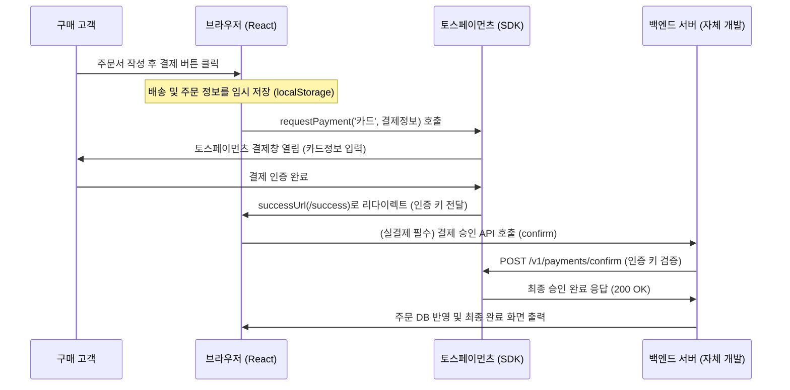

# 토스페이먼츠(Toss Payments) 실결제 적용 가이드

본 가이드는 ScentAtelier 쇼핑몰 프로젝트에 도입된 토스페이먼츠 결제 연동을 테스트 환경에서 **실제 상용(운영) 환경으로 전환할 때 필요한 작업 순서와 필수 개발 백엔드 API 연동**에 대해 설명합니다.

---

## 1. 개요 및 결제 흐름 (Flow)

현재 리액트(React) 프론트엔드 환경에서 결제 승인은 아래와 같은 흐름으로 연동되어 있습니다.



> [!WARNING]
> **보안상 클라이언트(React)에서 최종 결제 승인을 직접 처리하면 안 됩니다.** 
> 결제 수단 인증 후 토스가 리다이렉트한 `/success` 페이지에서, **백엔드 서버로 승인 API 호출**을 보낸 뒤 백엔드가 토스페이먼츠 API와 직접 통신하여 검증을 완료한 후 주문 데이터를 DB에 저장해야 안전합니다.

---

## 2. 실운영 환경 전환 시 변경 필요 사항

### ① API 클라이언트 키 교체
현재 `src/pages/Cart.tsx` 및 결제 요청 부분에 연동된 키는 **테스트용 클라이언트 키**입니다. 실제 결제가 이루어지게 하려면 토스페이먼츠 개발자센터에서 발급받은 **상용(운영) 클라이언트 키**로 변경해야 합니다.

- **대상 파일**: [Cart.tsx](file:///d:/송치왕/shop/src/pages/Cart.tsx)
- **수정 위치**: `loadTossPayments('test_ck_...')` 호출부
```diff
- const tossPayments = await loadTossPayments('test_ck_AQ92ymxN349opkWE5LRjVajRKXvd');
+ const tossPayments = await loadTossPayments('YOUR_LIVE_CLIENT_KEY');
```

### ② 리다이렉트 URL (Success / Fail) 도메인 수정
현재는 로컬 테스트 환경(`localhost:5173`) 기준으로 성공/실패 주소가 잡혀 있습니다. 실 서비스 배포 시 배포될 웹사이트 도메인 주소로 변경되도록 해야 합니다. (`window.location.origin`을 사용하므로, 배포 시 자동으로 배포 서버 주소로 적용됩니다.)

---

## 3. 백엔드 결제 승인 API 구현 예시 (Server-side)

토스페이 결제창 인증 성공 후 프론트엔드로 전달된 `paymentKey`, `orderId`, `amount`를 가지고 **백엔드 서버에서 토스페이먼츠 승인 요청 API를 호출**해야 정산 및 실결제가 완료됩니다.

### API 엔드포인트
- **Method**: `POST`
- **URL**: `https://api.tosspayments.com/v1/payments/confirm`
- **Headers**:
  - `Authorization`: `Basic <Base64로 인코딩한 시크릿 키 + :>`
  - `Content-Type`: `application/json`

### [Node.js Express 예시]
```javascript
const express = require('express');
const axios = require('axios');
const app = express();
app.use(express.json());

app.post('/api/payment/confirm', async (req, res) => {
  const { paymentKey, orderId, amount } = req.body;
  
  // 토스페이먼츠 상용(운영) Secret Key 사용 (절대 클라이언트에 노출 금지)
  const secretKey = "YOUR_LIVE_SECRET_KEY:"; 
  const basicAuth = Buffer.from(secretKey).toString('base64');

  try {
    const response = await axios.post(
      'https://api.tosspayments.com/v1/payments/confirm',
      { paymentKey, orderId, amount },
      {
        headers: {
          Authorization: `Basic ${basicAuth}`,
          'Content-Type': 'application/json',
        },
      }
    );
    
    // TODO: 자체 DB에 주문 성공 이력 기록 (결제 정보 보관)
    // database.saveOrder({ orderId, amount, paymentKey, ... });

    return res.status(200).json(response.data);
  } catch (error) {
    console.error('결제 승인 실패:', error.response.data);
    return res.status(error.response.status).json(error.response.data);
  }
});
```

---

## 4. 최종 확인 및 가동 체크리스트

- [ ] 토스페이먼츠 가맹점 계약 및 실 상용 Key 발급 완료 여부
- [ ] 프론트엔드 `Cart.tsx` 내 **상용 클라이언트 키 (Live Client Key)** 적용 여부
- [ ] 프론트엔드 `/success` 페이지가 시뮬레이션 데이터 등록 대신 **백엔드 승인 API(`/api/payment/confirm`)**를 호출하는 구조로 수정되었는지 여부
- [ ] 결제 취소(환불) 요청 시 사용할 백엔드 취소 API(`POST /v1/payments/{paymentKey}/cancel`) 추가 구현 여부
